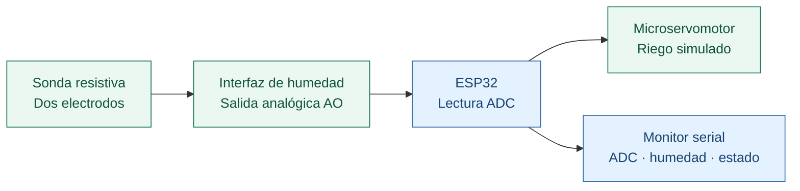

<div align="center">
  

  **Universidad de Antioquia · Internet de las Cosas · 2026-2**

  [Arquitectura](docs/ARQUITECTURA.md) · [Caracterización](docs/CALIBRACION.md) · [Evidencias](docs/EVIDENCIAS.md) · [Puesta en marcha](docs/COMO_EJECUTAR.md)
</div>

# Jardín inteligente IoT

El proyecto busca adaptar el riego al perfil hídrico de cada planta y a la disponibilidad de agua. Esta **primera entrega, dedicada a la capa de percepción**, explora la medición de humedad con un ESP32 y la respuesta de un servomotor que representa la activación del riego.

**Integrantes:** Santiago Palacio Cárdenas · Mariana Vásquez Castiblanco · Fabián Camilo Falla Ramírez.

## El prototipo

Caracterizamos una sonda resistiva mediante lecturas analógicas y ensayos con agua y papel absorbente. Las capturas registran valores ADC, su representación porcentual y los estados abierto y cerrado del servo.

<table>
  <tr>
    <td width="50%"><br/><b>Montaje de caracterización</b></td>
    <td width="50%"><br/><b>Ensayo de humedad con servo</b></td>
  </tr>
  <tr>
    <td><br/><b>Lecturas del sensor</b></td>
    <td><br/><b>Estados de control</b></td>
  </tr>
</table>

Las **20 fotografías originales** están reunidas en el [catálogo de evidencias](docs/EVIDENCIAS.md), con sus descripciones y [archivo de inventario](assets/inventario.csv).

El alcance actual es un prototipo de medición y riego simulado. El relé de 5 V y el HC-SR04 están seleccionados, pero pendientes de integración; la bomba no se consiguió. El firmware publicado es una **implementación de referencia reconstruida a partir del comportamiento conocido**: no se ha confirmado que coincida con el utilizado en la demostración ni se ha validado en la placa del equipo. El [estado del proyecto](docs/ESTADO_REAL.md) detalla las diferencias con la propuesta inicial.

## Arquitectura de percepción



Este esquema muestra relaciones funcionales. El cableado detallado, los GPIO y la alimentación del montaje aún requieren confirmación. La [arquitectura técnica](docs/ARQUITECTURA.md) reúne la configuración de referencia y las consideraciones eléctricas.

| Componente | Uso en esta entrega |
|---|---|
| ESP32 | Adquisición analógica y control del prototipo. Referencia exacta de la placa pendiente de confirmar. |
| Sonda resistiva y módulo de interfaz | Sensor caracterizado con agua y papel absorbente. |
| Microservomotor | Representa la apertura y el cierre del riego. |
| Módulo relé de 5 V | Seleccionado y fotografiado; sin integración funcional. |
| HC-SR04 | Seleccionado para medir el nivel del tanque; integración pendiente. |
| Bomba de agua | Pendiente de adquisición. |

## Caracterización del sensor

| Condición | ADC visible | Humedad mostrada | Registro |
|---|---:|---:|---|
| Seco | 4095 | 0 % | [E01](assets/fotos/01-adc-seco-4095.png) |
| Húmedo | 2064–2079 | 100 % | [E03](assets/fotos/03-adc-humedo-2077.png) |
| Humedad intermedia | 2671–2449 | 73–84 % | [E11](assets/fotos/11-adc-estado-intermedio.png) |
| Ensayo con servo | 1655–1686 / 4095 | 100 % / 0 % | [E18](assets/fotos/18-consola-servo-estados.png) |

Los registros corresponden a ensayos con distintos valores de calibración; el porcentaje es una escala relativa del ensayo, no una medición de contenido volumétrico de agua en suelo. En el código de referencia se utiliza una conversión lineal limitada a 0–100 %, con `ADC_SECO = 4095` y `ADC_MOJADO = 2100`. El [documento de calibración](docs/CALIBRACION.md) explica la fórmula, las diferencias entre capturas y el procedimiento para repetir la caracterización.

## Lógica de funcionamiento

| Humedad | Comportamiento |
|---|---|
| **0 %** | Servo abierto: riego simulado activo, según lo reportado por el equipo. |
| **70 % o más** | Servo cerrado: riego simulado desactivado, según lo reportado por el equipo. |
| **1–69 %** | El firmware de referencia conserva el estado anterior; este intervalo no está documentado en la demostración. |

La implementación de referencia inicia con el servo cerrado y ordena cerrarlo ante una lectura inválida o la ausencia de nuevas muestras. Estas medidas son decisiones del código publicado y deben comprobarse físicamente.

## Firmware y puesta en marcha

El proyecto utiliza **C, PlatformIO, ESP-IDF y FreeRTOS**. Una tarea adquiere muestras de ADC1 cada segundo, aplica una media móvil de ocho muestras y calcula el porcentaje. Otra tarea recibe la lectura más reciente por una cola y controla el PWM del servo mediante LEDC. La conversión, el filtro y las reglas de control están separados del acceso al hardware para poder probarlos en PC.

Antes de cargar el firmware, revisar [project_config.h](include/project_config.h): **GPIO34 y GPIO18 son ejemplos, no conexiones confirmadas**. También deben ajustarse la calibración, la alimentación y el recorrido del servo. Los pasos están en la [guía de puesta en marcha](docs/COMO_EJECUTAR.md).

Compilación con PlatformIO instalado:

```bash
pio run -e esp32doit-devkit-v1
```

Verificaciones en PC (requieren Make, compilador C y Python 3):

```bash
make -C tests test
python scripts/verificar_evidencias.py
```

Los resultados y las comprobaciones pendientes se encuentran en [Pruebas](docs/PRUEBAS.md). Las pruebas nativas verifican la lógica y no sustituyen los ensayos del ESP32.

## Estructura del repositorio

```text
.
├── README.md
├── platformio.ini           # Entorno PlatformIO con ESP-IDF
├── CMakeLists.txt           # Proyecto ESP-IDF
├── src/                    # Tareas FreeRTOS, ADC, PWM y lógica de control
├── include/                # Configuración y declaraciones públicas
├── tests/                  # Pruebas de lógica C en PC
├── assets/
│   ├── fotos/              # 20 fotografías originales
│   ├── diagramas/          # Fuentes Mermaid y portada SVG
│   └── inventario.csv      # Identificación y origen de las evidencias
├── docs/                   # Documentación técnica y académica
└── scripts/                # Verificación del inventario
```

## Documentación de la entrega

| Documento | Contenido |
|---|---|
| [Requisitos de entrega](docs/REQUISITOS_ENTREGA.md) | Los nueve elementos de la consigna y su estado. |
| [Equipo](docs/EQUIPO.md) | Integrantes y datos de contacto por confirmar. |
| [Problemas y soluciones](docs/PROBLEMAS_Y_SOLUCIONES.md) | Dificultades del montaje y acciones pendientes. |
| [Consideraciones académicas](docs/RIESGOS_ACADEMICOS.md) | Aspectos técnicos que requieren evidencia adicional. |
| [Referencias](docs/REFERENCIAS.md) | Material del curso y documentación técnica. |

El [repositorio público](https://github.com/spalacioc05/jardin-inteligente-iot-capa-percepcion) sirve de soporte al informe que se entrega por Classroom. Quedan por completar los esquemas eléctricos detallados, la referencia exacta de la placa, los correos institucionales y la validación física del firmware. El equipo reporta disponer del video de demostración; su enlace aún no está incorporado.

[Declaración de uso de inteligencia artificial](docs/USO_DE_IA.md).