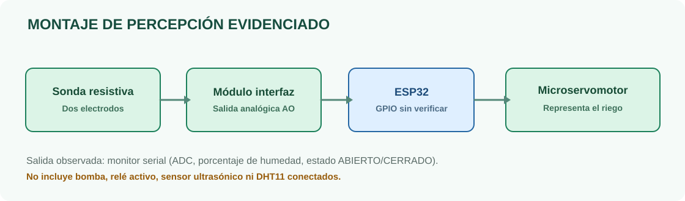

<div align="center">
  

  **Proyecto académico · Universidad de Antioquia · Ingeniería · 2026-2**

  `ESP32` · `FreeRTOS` · `ESP-IDF` · `PlatformIO` · `ADC` · `Servo` · `Capa de percepción`

  [Estado real](docs/ESTADO_REAL.md) · [Arquitectura](docs/ARQUITECTURA.md) · [Evidencias](docs/EVIDENCIAS.md) · [Código](src/main.c) · [Pruebas](docs/PRUEBAS.md) · [Requisitos](docs/REQUISITOS_ENTREGA.md)
</div>

---

# Jardín inteligente IoT: riego adaptativo

**Primera entrega — capa de percepción.** Documento y código de referencia para el proyecto «Jardín inteligente IoT para riego adaptativo según el perfil hídrico de la planta y la disponibilidad de agua».

> [!IMPORTANT]
> Este repositorio reúne **evidencia real de caracterización de humedad y un prototipo de control con servo**. La bomba no se consiguió; el relé 5 V y el HC-SR04 están fotografiados pero **no implementados en el montaje funcional**. **No se recibió el firmware original**: el código bajo `src/` es una **reconstrucción didáctica** que aún debe compilarse y verificarse en la placa del equipo. [Ver detalle](docs/ESTADO_REAL.md).

## Equipo

- **Santiago Palacio Cárdenas**
- **Mariana Vásquez Castiblanco**
- **Fabián Camilo Falla Ramírez**

**Asignatura:** Internet de las Cosas · **Universidad:** Universidad de Antioquia · **Semestre:** 2026-2. Los correos institucionales no fueron proporcionados; [completar en el informe](docs/EQUIPO.md).

## 01 · Qué se consiguió demostrar

La sonda resistiva conectada a un módulo de interfaz entrega lecturas analógicas al ESP32. El porcentaje de humedad varía con las condiciones del ensayo; un microservo representa el estado de riego. El equipo reporta las siguientes reglas para su demostración:

| Condición | Estado observado/referido | Significado en prototipo |
|---|---|---|
| Humedad = **0 %** | `servo ABIERTO` | Riego **simulado** activo |
| Humedad **≥70 %** | `servo CERRADO` | Riego **simulado** apagado |
| Humedad **1–69 %** | **No suficientemente documentado** | El código reconstruido conserva el estado previo; **no atribuirlo al código original** |

### Galería del ensayo real

<table><tr><td width="50%"><br/><b>Montaje de caracterización</b></td><td width="50%"><br/><b>Montaje del prototipo</b></td></tr><tr><td><br/><b>Caracterización: humedad alta</b></td><td><br/><b>Control de estados en consola</b></td></tr></table>

Todas las [**20 imágenes originales están catalogadas**](docs/EVIDENCIAS.md), con un [inventario CSV](assets/inventario.csv) de origen y alcance probatorio.

## 02 · Arquitectura del prototipo



**Atención:** esquema **funcional**, no diagrama eléctrico final. Las capturas no revelan de manera confiable los GPIO exactos, polaridades ni alimentación real. El [documento de arquitectura](docs/ARQUITECTURA.md) detalla lo confirmado, los **pines de ejemplo** del firmware reconstruido y las precauciones eléctricas.

## 03 · Calibración: qué muestran los registros

| Estado de ensayo | ADC visible | % visible | Evidencia |
|---|---:|---:|---|
| Seco | 4095 | 0 % | [E01](assets/fotos/01-adc-seco-4095.png) |
| Húmedo (sesión de caracterización) | 2064–2079 | 100 % | [E03](assets/fotos/03-adc-humedo-2077.png) |
| Humedad intermedia | 2671–2449 | aprox. 73–84 % | [E11](assets/fotos/11-adc-estado-intermedio.png) |
| Ensayo con servo | 1655–1686 / 4095 | 100 % / 0 % | [E18](assets/fotos/18-consola-servo-estados.png) |

**Distintas capturas usan distintas calibraciones**. Estas tablas transcriben valores visibles; no son mediciones adicionales. [Explicación y fórmula orientativa](docs/CALIBRACION.md).

## 04 · Componentes: estado explícito

| Elemento | Estado demostrado |
|---|---|
| Placa ESP32 | Visible operando; el monitor usa entorno `esp32doit-devkit-v1`, pero la **referencia física exacta debe verificarse**. |
| Sonda **resistiva** de humedad y módulo interfaz | **Conectados y caracterizados**. No confundir con sensor capacitivo originalmente propuesto. |
| Microservomotor azul | **Prototipo de actuación demostrativa**. Referencia exacta no legible. |
| Módulo relé 5 V | **Fotografiado/seleccionado**, sin integración verificada. |
| HC-SR04 | **Fotografiado/seleccionado** para nivel de tanque; integración pendiente por adaptación de tensión. |
| Bomba de agua | **No disponible** en esta etapa según el equipo. |
| DHT11 | Previsto en propuesta, **no demostrado** aquí. |

## 05 · Estructura del repositorio

```text
.
├── README.md
├── platformio.ini                # Placa inferida del nombre de entorno observado
├── CMakeLists.txt                # Proyecto ESP-IDF
├── src/
│   ├── main.c                    # Tareas FreeRTOS + ADC + control LEDC del servo
│   └── control_logic.c           # Conversión, filtro y reglas (testeables en host)
├── include/                      # Parámetros y declaraciones públicas
├── tests/                        # Pruebas de lógica C independientes del ESP32
├── assets/
│   ├── fotos/                    # Las 20 fotografías ORIGINALES
│   ├── diagramas/                # Diagramas SVG y código Mermaid
│   └── inventario.csv            # Trazabilidad de evidencias
├── docs/                         # Análisis, diagramas, guía de publicación,
│                                # calibración, uso de IA y requisitos
├── scripts/                      # Control de integridad del inventario
└── .github/workflows/            # Solo pruebas C en host; no firmware físico
```

## 06 · Firmware de referencia: PlatformIO / ESP-IDF / FreeRTOS

Se creó una **versión reconstruida** utilizando las tecnologías exigidas por la tarea, con dos tareas FreeRTOS que intercambian lecturas por cola, ADC1, filtrado por media móvil, mapeo 0–100% y PWM LEDC para el servo. La implementación corresponde a la **evidencia disponible**, sin simular que ya existe bomba o sensado ultrasónico.

> [!WARNING]
> **No cargar sin revisar `include/project_config.h`**: `GPIO34` y `GPIO18` son **suposiciones de configuración**, NO GPIO confirmados del montaje fotografiado. Verificar niveles eléctricos (en especial 5 V vs 3,3 V), alimentación del servo y placa exacta. El firmware de este repositorio **NO está validado en hardware**.

Inicio: [**Guía de compilación y pruebas físicas**](docs/COMO_EJECUTAR.md).

Pruebas de control en equipo de desarrollo, sin ESP32:

```bash
make -C tests test
python3 scripts/verificar_evidencias.py
```

## 07 · Lo que falta para el entregable oficial

La [**matriz de los 9 requisitos**](docs/REQUISITOS_ENTREGA.md) diferencia evidencia ya disponible y lo que falta (correos, referencia exacta de placa, **diagramas eléctricos precisos**, enlace real al video, pruebas de FreeRTOS en equipo). El informe en formato libre se entregará por **Classroom**, junto con enlaces de video y GitHub.

**Video:** el equipo informó que **ya lo tiene**, pero en este paquete **no se dispone de su archivo ni URL**. Consultar [guía de narración](docs/GUIA_VIDEO.md) y agregar después el enlace sin inventarlo.

**Riesgos frente a la consigna:** el sensor digital y el filtro de media móvil en el firmware original **no están demostrados**; ver [evaluación de cumplimiento y riesgos](docs/RIESGOS_ACADEMICOS.md).

**Pendientes técnicos:** [problemas y soluciones](docs/PROBLEMAS_Y_SOLUCIONES.md) · [plan de pruebas](docs/PRUEBAS.md) · [estado real y límites](docs/ESTADO_REAL.md).

## 08 · Fuentes y ética académica

La documentación se basa en material del curso y evidencias compartidas por el equipo. **No se reproducen íntegramente** los PDF ni el ZIP educativo del profesor. [Referencias](docs/REFERENCIAS.md).

Conforme al requisito de la tarea, incluimos una [**declaración transparente del uso de IA**](docs/USO_DE_IA.md). El texto y código de referencia se deben revisar y validar antes de presentarlos como trabajo funcional. Las pruebas automáticas del proyecto no prueban que el hardware haya ejecutado este firmware.

---

<div align="center"><small>Proyecto universitario · Capa de percepción · Evidencias reales + código reconstruido claramente etiquetado</small></div>
