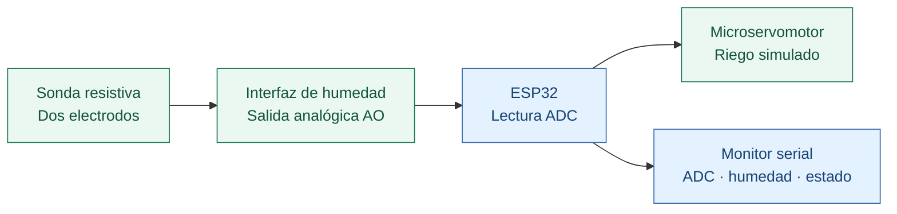
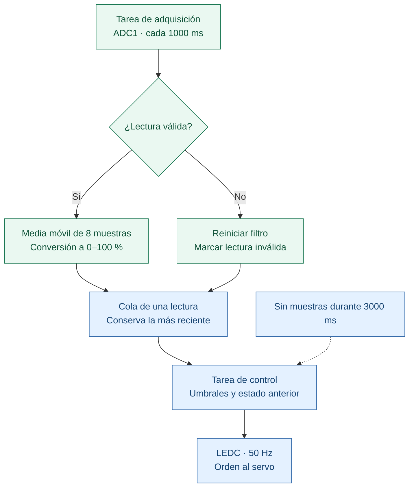
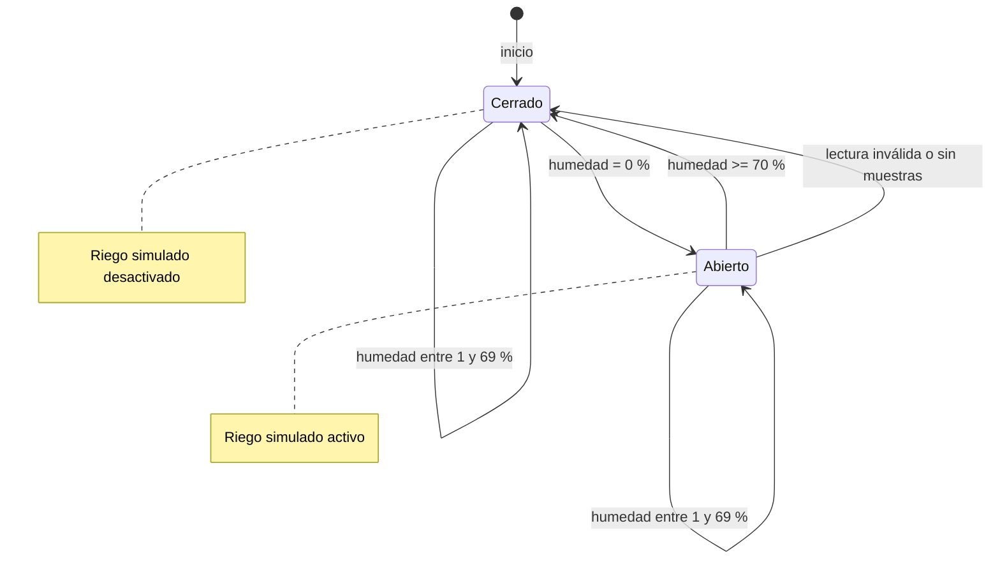
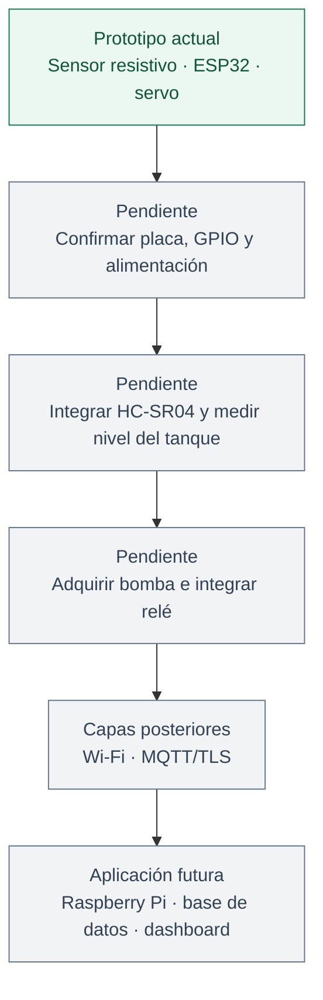

# Arquitectura de percepción

## Montaje demostrado

[Fuente Mermaid](../assets/diagramas/arquitectura-actual.mmd). Las flechas representan relaciones funcionales, no un esquema eléctrico. Las fotografías no permiten confirmar los GPIO ni la alimentación de cada componente.

## Conexiones de referencia

Estos valores corresponden a [project_config.h](../include/project_config.h); deben contrastarse con el montaje antes de cargar el firmware.

| Componente | Señal | Configuración de referencia | Confirmación física |
|---|---|---|---|
| Interfaz de humedad | AO | ADC1, canal 6 / GPIO34, solo ESP32 clásico | Pendiente |
| Interfaz de humedad | VCC y GND | Alimentación compatible con la salida analógica y tierra común | Pendiente |
| Microservomotor | PWM | GPIO18, 50 Hz; pulsos de 1000 y 2000 µs | Pendiente de pin y recorrido |
| Microservomotor | Alimentación y GND | Fuente adecuada para el servo y tierra común con ESP32 | Pendiente |
| Relé de 5 V | Control | Sin GPIO configurado | Sin integrar |
| HC-SR04 | TRIG y ECHO | Sin GPIO configurados | Sin integrar |

La entrada ADC del ESP32 debe recibir una tensión compatible con sus especificaciones; la atenuación no la hace tolerante a 5 V. Medir AO antes de conectarla. El servo requiere una fuente adecuada: un GPIO entrega la señal de control, no su potencia.

Para una futura integración del HC-SR04 se debe comprobar la tensión de ECHO y adaptar el nivel al ESP32 cuando corresponda. También deben verificarse la alimentación y los niveles de control del módulo relé. Estos trabajos siguen pendientes; no se dispone de un esquema eléctrico definitivo.

## Firmware de referencia

El filtro utiliza únicamente las muestras disponibles durante el arranque, sin completar la ventana con ceros. Tras un error de adquisición, comienza una ventana nueva. La cola evita acumular lecturas antiguas; un error de lectura o tres segundos sin muestras produce una orden de cierre.

El PWM inicia en cerrado. Si no se puede crear la cola o alguna tarea, se registra el error y se liberan los recursos creados para la adquisición y el control. Los errores de inicialización ADC/PWM se gestionan mediante `ESP_ERROR_CHECK`. Estas medidas no sustituyen una protección física ni garantizan el cierre ante pérdida de alimentación.

## Estados del control de referencia

[Fuente Mermaid](../assets/diagramas/estados-control.mmd). Los umbrales de 0 % y ≥70 % provienen del comportamiento reportado. El estado inicial, la conservación del estado entre 1–69 % y las respuestas a errores son decisiones de esta implementación, sin confirmación en el firmware de la demostración.

## Continuación del proyecto

El relé y el HC-SR04 están fotografiados, pero no forman parte de la cadena funcional anterior. La propuesta también contempla DHT11 y capas de red y aplicación, sin integración demostrada en esta entrega.

[Fuente Mermaid](../assets/diagramas/evolucion.mmd). Aquí las flechas indican etapas de desarrollo, no conexiones eléctricas.