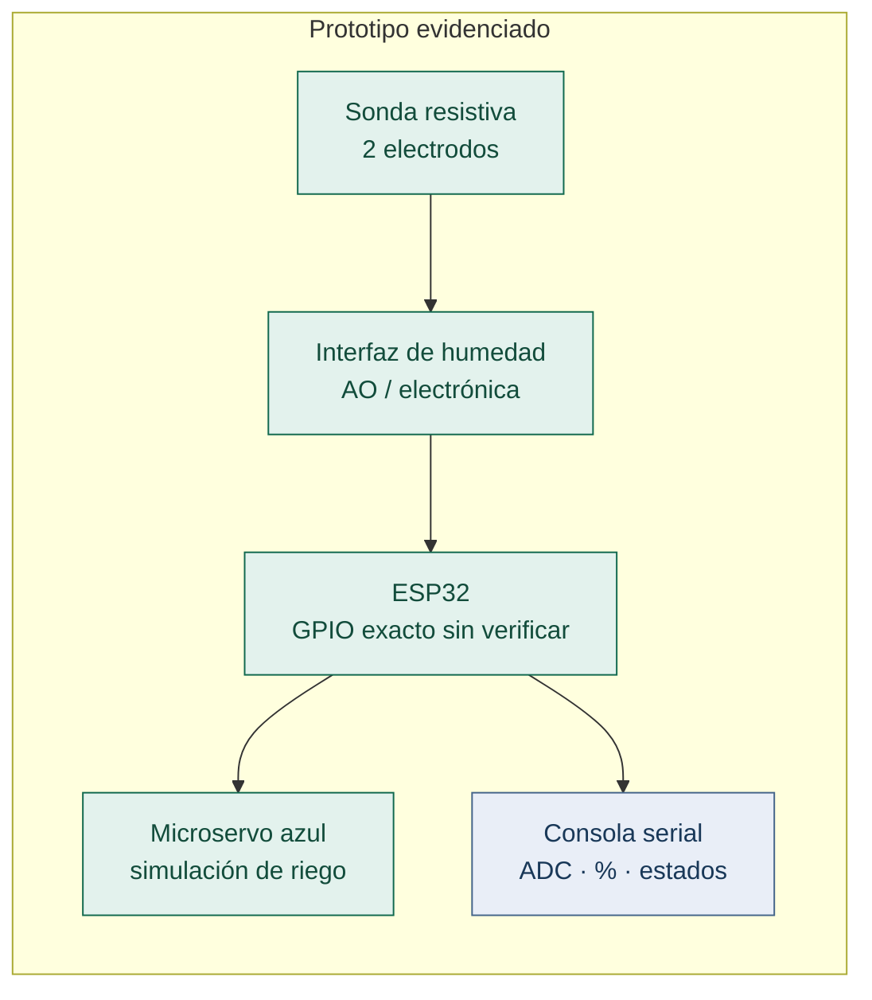
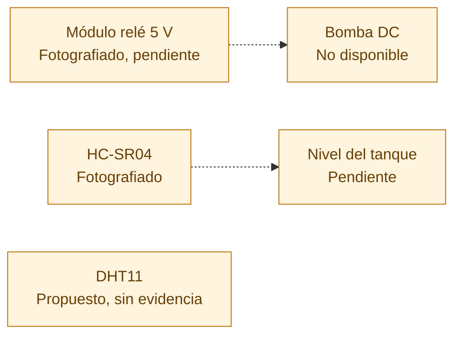
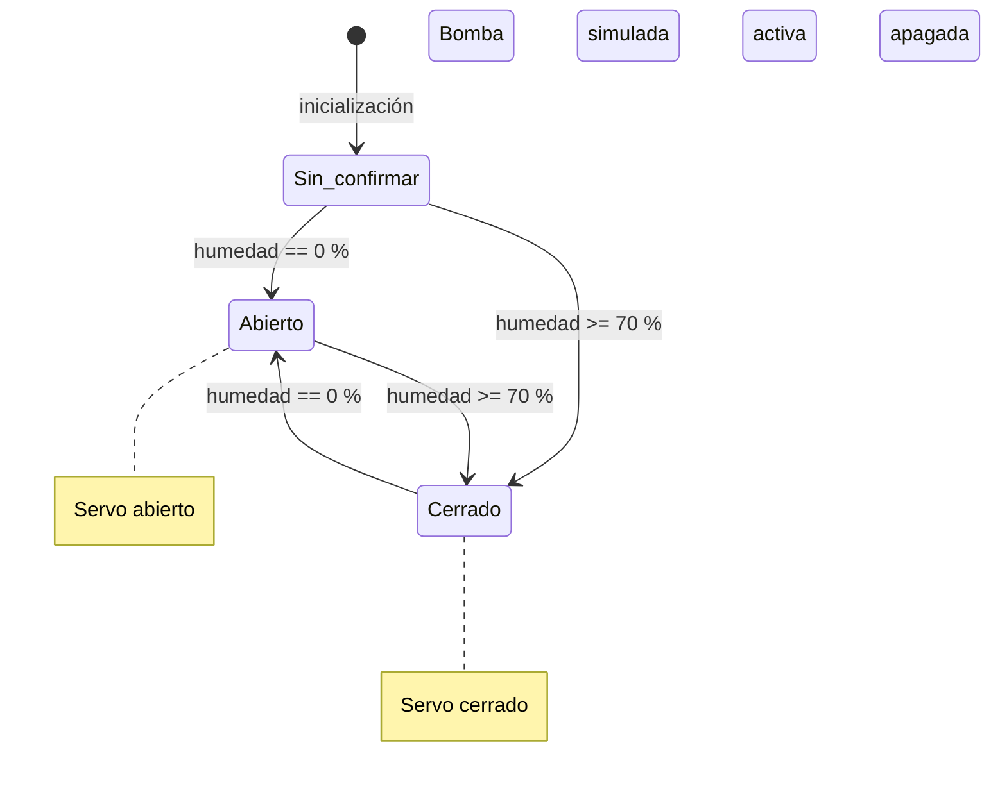
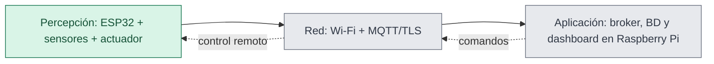

# Arquitectura: montaje observado vs. propuesta futura

## Montaje observado

Este diagrama es **de bloques y conexiones funcionales**, no el esquema eléctrico preciso que todavía exige la entrega. Las imágenes no permiten certificar los números de GPIO ni los voltajes de alimentación.

## Elementos fotografiados que NO deben dibujarse como conectados

## Pinout orientativo para el código reconstruido (NO certificado)

| Componente | Señal | Configuración de ejemplo | ¿Pudimos confirmar el pin real? |
|---|---|---|---|
| Módulo humedad | AO (analógica) | ADC1_CHANNEL_6 / GPIO34 **solo ESP32 clásico** | **No** |
| Módulo humedad | VCC, GND | Alimentación compatible, GND común | **No** |
| Microservo | Control PWM | GPIO18 **ejemplo** | **No** |
| Microservo | Alimentación, GND | Fuente externa compatible, tierra común | **No** |
| Relé de 5 V | Control | **No configurado** | No conectado según evidencia |
| HC-SR04 | TRIG / ECHO | **No configurados** | No integrado según mensaje |

### Seguridad eléctrica

- El GPIO de ESP32 no es una fuente de potencia para un servo o una bomba.
- La entrada analógica del ESP32 **no tolera automáticamente 5 V**; verificar la tensión en AO con multímetro.
- El HC-SR04 suele alimentarse a 5 V y su pin ECHO puede entregar 5 V. Antes de conectarlo al ESP32, diseñar un **divisor resistivo o adaptación de nivel** para ECHO, con especificaciones del módulo exacto. No se asume que el TRIG requiera amplificador sin comprobar su hoja de datos y comportamiento.
- El relé requiere verificar tensión de la bobina/módulo, alimentación, activación lógica y aislamiento. Nunca alimentar la bomba desde pines del ESP32.
- El sensor resistivo de humedad montado NO es lo mismo que el capacitivo de la propuesta.

## Lógica demostrada por mensajes del equipo

Los casos `1–69 %` **no se describen con certeza en las evidencias**. En la implementación reconstruida se retiene el estado anterior por decisión de diseño, nunca como afirmación sobre el firmware original.

## Proyecto global (NO implementado en esta fase)

Futuro: cableado real definitivo, HC-SR04 adaptado, medición de nivel de tanque, protección por vacío, relé y bomba, nuevas pruebas y desarrollo de capas red/aplicación.
