# Catálogo de las 20 evidencias visuales

Las fotografías son aportadas por el equipo y se incluyen **sin reemplazarlas por fotos de internet**. No se alteró su contenido. Cada ficha conserva el nombre del archivo de origen para rastreabilidad.

El análisis describe exclusivamente lo visible y los mensajes del equipo; no reemplaza mediciones de laboratorio ni prueba circuitos completos.

## E01 — Captura de monitor: ADC 4095, humedad 0%
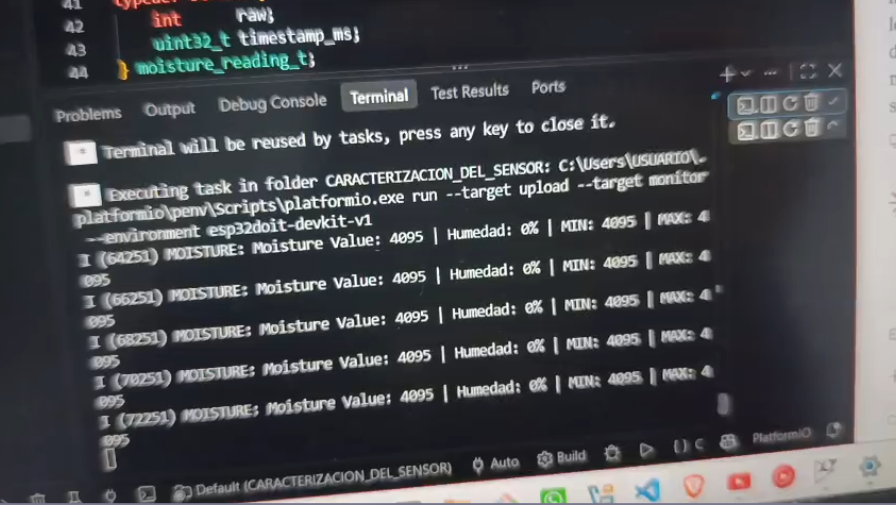
**Categoría:** Caracterización. **Origen:** `image(20261009-000303).png`.

**Lectura:** Registro repetido de lectura seca; MIN y MAX dependen de la corrida.

---

## E02 — Detalle de sonda resistiva de dos electrodos
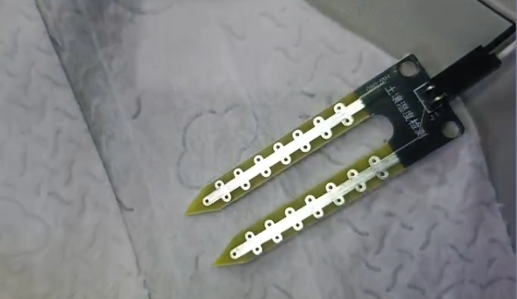
**Categoría:** Caracterización. **Origen:** `image(20261009-000333).png`.

**Lectura:** Sonda de horquilla con pistas conductoras; no es el sensor capacitivo originalmente propuesto.

---

## E03 — Captura de monitor: ADC cercano a 2064–2079, humedad 100%
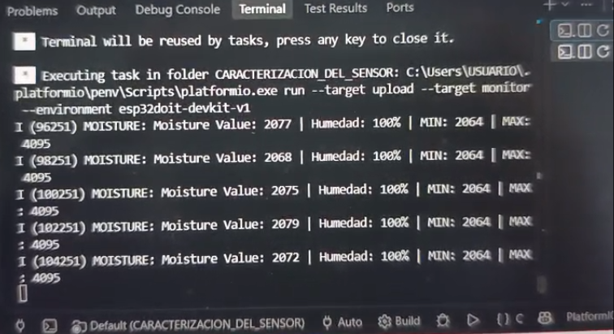
**Categoría:** Caracterización. **Origen:** `image(20261009-000357).png`.

**Lectura:** La captura muestra MIN 2064 y MAX 4095 en esa sesión.

---

## E04 — Sonda de humedad conectada, vista superior
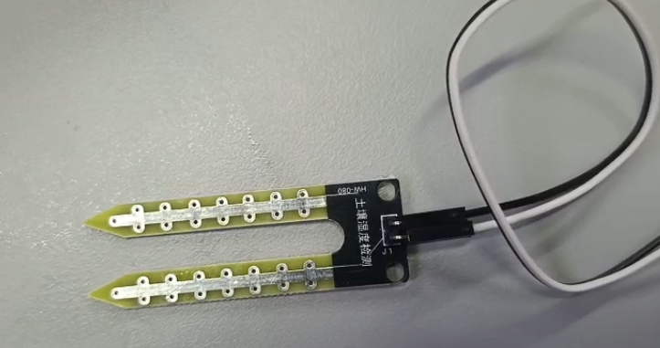
**Categoría:** Caracterización. **Origen:** `image(20261009-000412).png`.

**Lectura:** Se aprecia conector en la sonda y dos electrodos expuestos.

---

## E05 — Montaje ESP32, sonda e interfaz
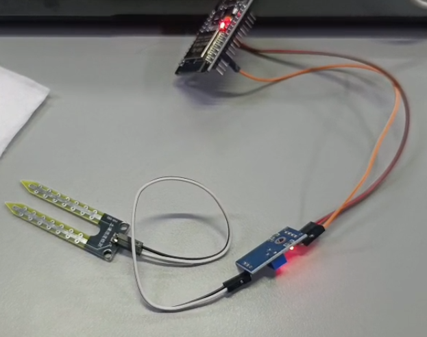
**Categoría:** Caracterización. **Origen:** `image(20261009-000424).png`.

**Lectura:** La tarjeta azul con potenciómetro y LED es el módulo de interfaz de sonda; pines exactos no legibles.

---

## E06 — Monitor: 4095 y 0%, con otro mínimo de calibración
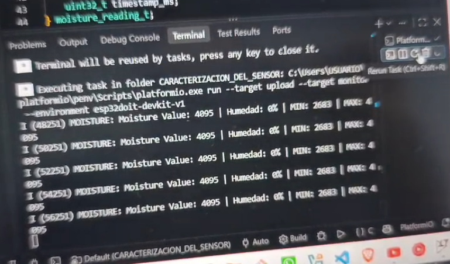
**Categoría:** Caracterización. **Origen:** `image(20261009-000437).png`.

**Lectura:** En esta captura MIN ≈2683 y MAX 4095; distinta calibración respecto a otras fotos.

---

## E07 — Sonda próxima a recipiente con agua
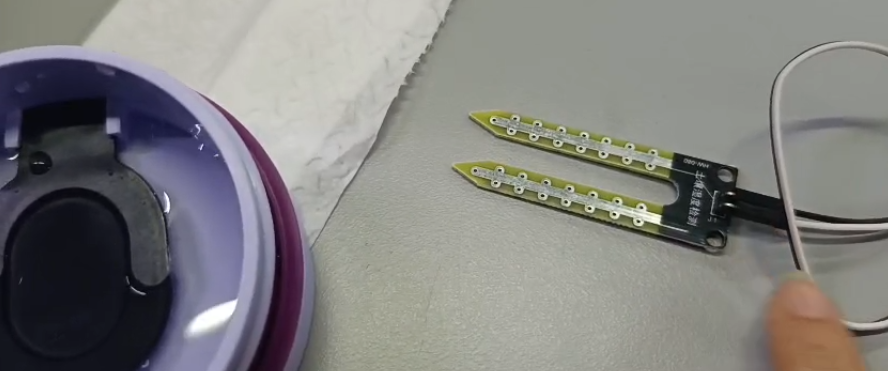
**Categoría:** Caracterización. **Origen:** `image(20261009-000557).png`.

**Lectura:** Secuencia visual de ensayo de humedad.

---

## E08 — Sonda parcialmente en agua del recipiente
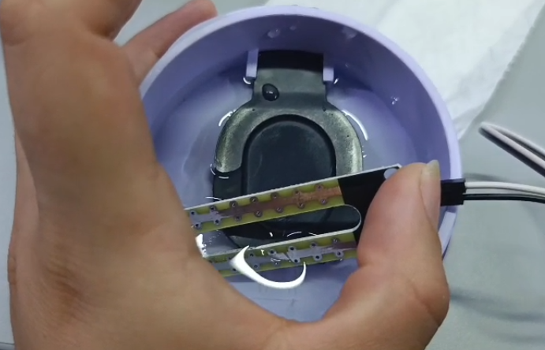
**Categoría:** Caracterización. **Origen:** `image(20261009-000622).png`.

**Lectura:** Ensayo experimental, no prueba de medición volumétrica calibrada de suelo.

---

## E09 — Monitor: lecturas 2100–2315 y 100–91%
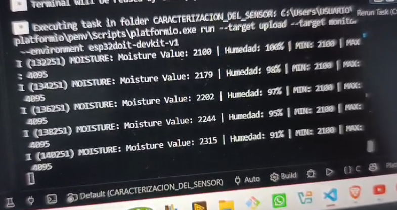
**Categoría:** Caracterización. **Origen:** `image(20261009-000636).png`.

**Lectura:** Registros relacionados con variación de humedad tras ensayo.

---

## E10 — Papel absorbente usado en experimento
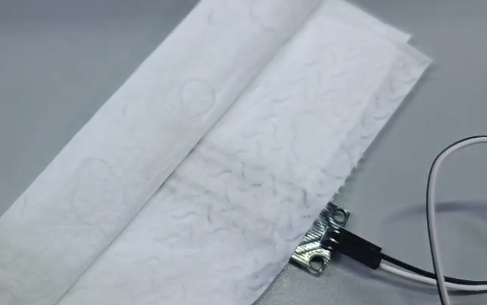
**Categoría:** Caracterización. **Origen:** `image(20261009-000726).png`.

**Lectura:** Material utilizado para variar la humedad detectada.

---

## E11 — Monitor: ADC 2671–2449, humedad aprox. 73–84%
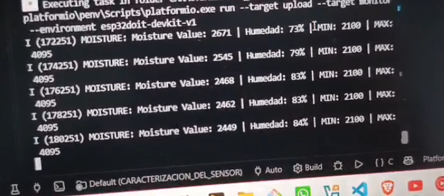
**Categoría:** Caracterización. **Origen:** `image(20261009-000744).png`.

**Lectura:** Lecturas intermedias; no representan un nuevo sensor.

---

## E12 — Fotografía de módulo relé de 5 V
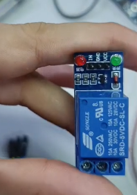
**Categoría:** Componente pendiente. **Origen:** `image(20261009-000904).png`.

**Lectura:** Componente disponible/seleccionado, pero no hay evidencia de conexión ni actuación sobre bomba.

---

## E13 — Fotografía de módulo ultrasónico HC-SR04
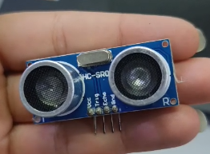
**Categoría:** Componente pendiente. **Origen:** `image(20261009-000924).png`.

**Lectura:** Seleccionado para nivel del tanque; según el equipo, no integrado por adaptación de niveles lógicos.

---

## E14 — Fotografía de placa ESP32 alimentada
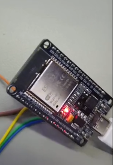
**Categoría:** Prototipo. **Origen:** `image(20261009-001006).png`.

**Lectura:** Se aprecia LED de alimentación y módulo ESP32; modelo exacto no verificable en la foto.

---

## E15 — Módulo de interfaz de humedad con potenciómetro
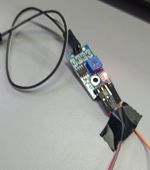
**Categoría:** Prototipo. **Origen:** `image(20261009-001014).png`.

**Lectura:** Tarjeta de acondicionamiento, probablemente familia LM393, referencia exacta no legible.

---

## E16 — Microservomotor azul con brazo blanco
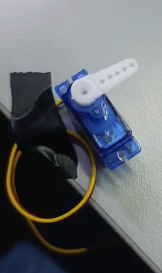
**Categoría:** Prototipo. **Origen:** `image(20261009-001026).png`.

**Lectura:** Actuador demostrativo; familia tipo SG90 por apariencia, sin referencia comprobada.

---

## E17 — Conjunto sensor e interfaz cableados
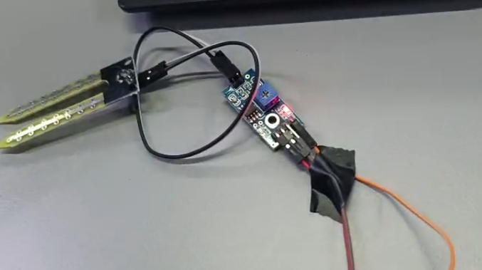
**Categoría:** Prototipo. **Origen:** `image(20261009-001103).png`.

**Lectura:** Montaje usado en pruebas de control; no se deben deducir GPIO exactos.

---

## E18 — Monitor: AUTO servo ABIERTO/CERRADO
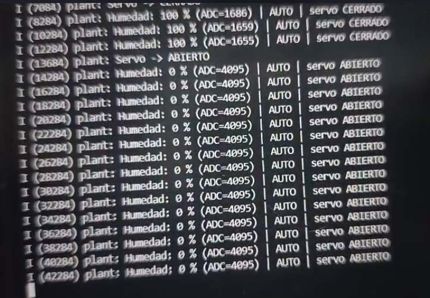
**Categoría:** Prototipo. **Origen:** `image(20261009-001116).png`.

**Lectura:** Se observan mensajes de cambio de estado del servo y lecturas ADC.

---

## E19 — Sonda sobre papel y servo en la misma escena
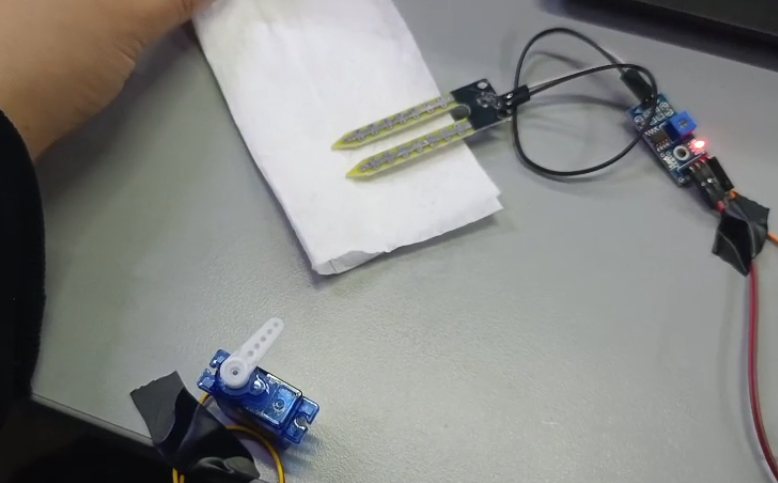
**Categoría:** Prototipo. **Origen:** `image(20261009-001318).png`.

**Lectura:** Evidencia física de escenario de prueba de respuesta al cambio de humedad.

---

## E20 — Prueba colocando mano sobre papel que cubre la sonda
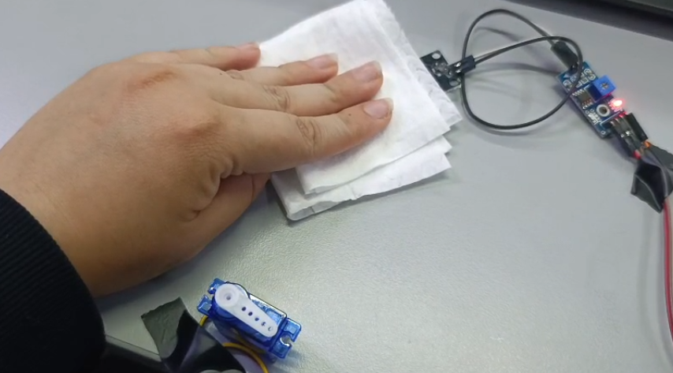
**Categoría:** Prototipo. **Origen:** `image(20261009-001328).png`.

**Lectura:** Continuación del experimento con montaje y servo visibles.

---
